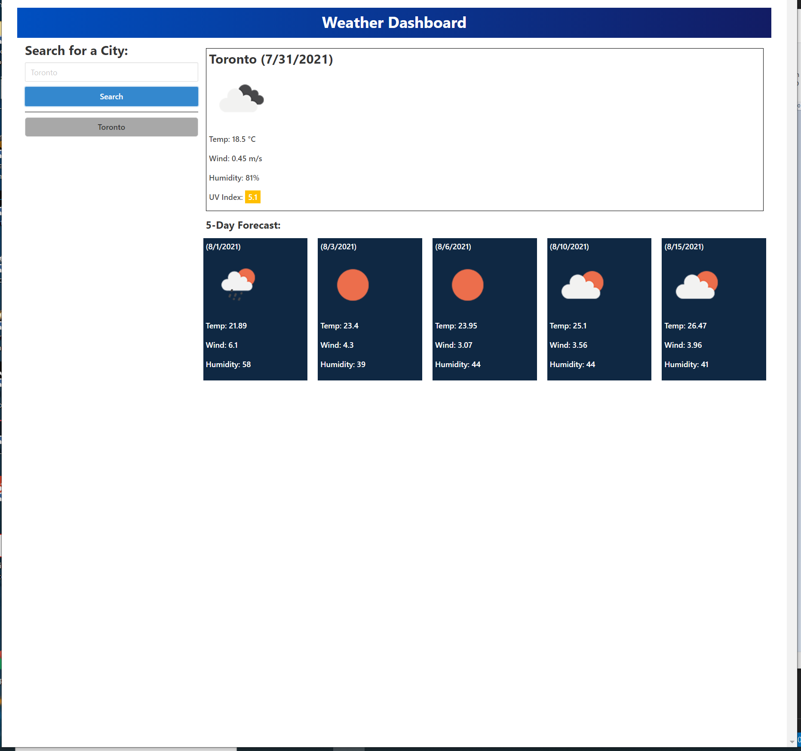

# Weather Dashboard

## Purpose

CREATE a weather dashboard with form inputs
WHEN I search for a city
THEN I am presented with current and future conditions for that city and that city is added to the search history
WHEN I view current weather conditions for that city
THEN I am presented with the city name, the date, an icon representation of weather conditions, the temperature, the humidity, the wind speed, and the UV index
WHEN I view the UV index
THEN I am presented with a color that indicates whether the conditions are favorable, moderate, or severe
WHEN I view future weather conditions for that city
THEN I am presented with a 5-day forecast that displays the date, an icon representation of weather conditions, the temperature, the wind speed, and the humidity
WHEN I click on a city in the search history
THEN I am again presented with current and future conditions for that city

## Built With

* HTML
* CSS
* JavaScript
* Bulma
* Moment.js
* OpenWeatherMap.org

## Website

https://mikhaelhamoy.github.io/challenge-week-6/

## Screenshots

## Contribution

Made by Mikhael Hamoy